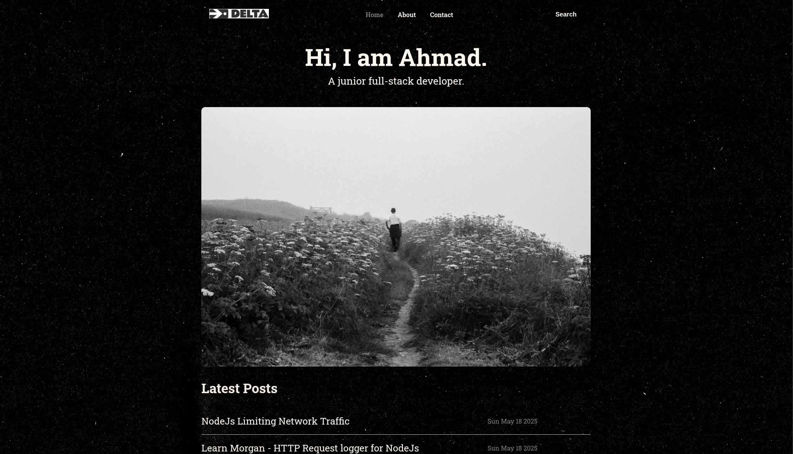
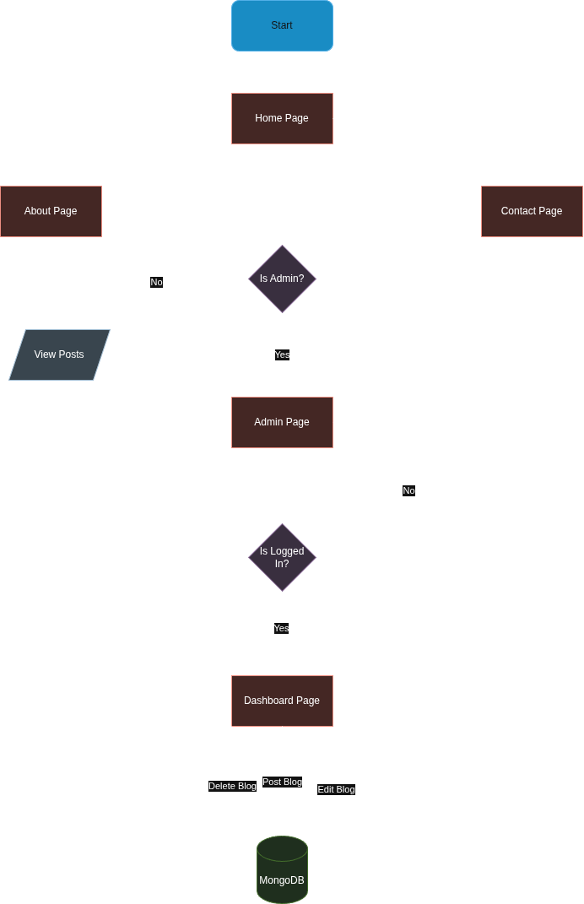
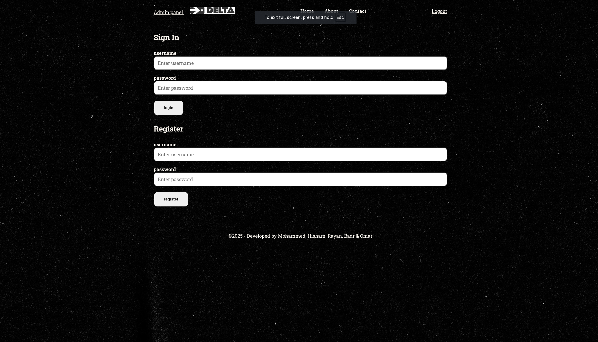
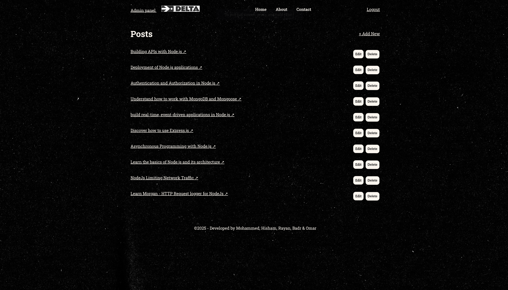
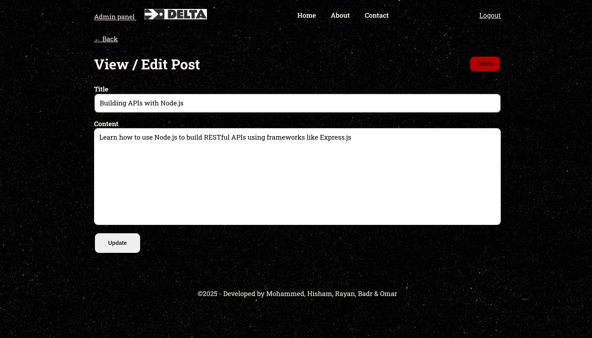

# A Personl Blog with Unique UI!
<hr>


## System Overview
<hr>
This project pleases both creators and consumers, it allows a creator to log in through the /admin page and post, edit, delete blogs through a REST API that saves everything using MongoDB.
A consumer will be able to view those blogs without the ability to alter them.

### Website Flowchart
<hr>


### Installation
<hr>
To setup this project locally, follow these steps:
<br/>
1. Install NodeJS
2. setup a MongoDB cluster
3. Install required packages:
```
npm i bcrypt connect-mongo cookie-parser dotenv ejs express-ejs-layouts express-session jsonwebtoken method-override mongoose
npm i nodemon --save-dev
```
4. create .env file and store your MongoDB credentials, example:
```
MONGODB_URI=mongodb+srv://<username>:<password>@clusterName.xxxxxxx.mongodb.net/blog
JWT_SECRET=MySecretBlog
```
5. Start the server
```
npm run dev
```

### Technologies
<hr>


### Showcase
<hr>

#### Homepage:


#### Admin Login Page:



#### Admin Dashboard Page:


#### View/Edit Post Page:



## Resources
<hr>
<a href="https://www.youtube.com/@RaddyDev" rel="noopener noreferrer">Raddy's Channel</a>


## Contributors
<hr>
Mohammed<br/>
Hisham<br/>
Badr<br/>
Omar


